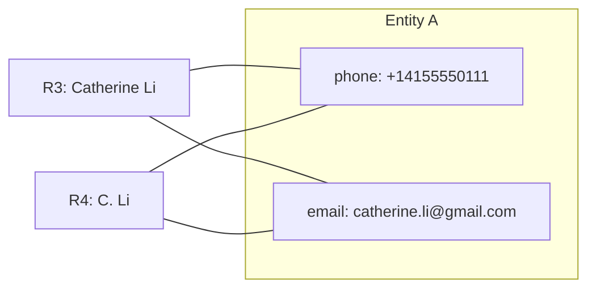
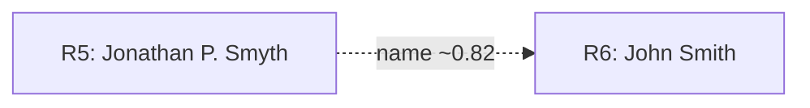

 # Entity Resolution: Linking Records to Real‑World Identities

## Overview

[Entity resolution](https://en.wikipedia.org/wiki/Record_linkage) is the process of linking records together to classify real world entities. In the connected age, data must reliably map back to real‑world entities. From a governance standpoint, we have to ensure that imposters don’t bypass laws and regulations [FINRA — Anti‑Money Laundering](https://www.finra.org/rules-guidance/key-topics/aml). On the broader internet, there’s often no guaranteed method to verify that someone is who they claim to be.

Financial institutions may appear to have it easy because they collect high‑assurance identifiers like SSNs or driver’s licenses. In practice, the hard part is linking records when those definitive identifiers are missing, outdated, or entered inconsistently across systems—at the extreme volumes modern platforms handle.

### Example

Keeping it simple, shoould these records be linked?
| Record | Name                  | Email                       | Phone           |
|:------:|-----------------------|-----------------------------|-----------------|
| R1     | Catherine Li          | catherine.li@gmail.com      | 415‑555‑0111    |
| R2     | C. Li                 | catherine.li+work@gmail.com | +1 415 555 0111 |

Why R1 ↔ R2 link (after normalization):

- Phone: Same number after normalization (+14155550111).
- Email: Gmail plus‑tag variant maps to the same canonical address.
- Name: Initials align with the full name.

#### Fuzzy connection (candidate match)

For certain fields we can use approximate or fuzzy matching. This is useful for fields such as names and emails. It is not as useful in fields such as Phonenumbers.

| Record | Name               | Email                    | Phone         |
|:------:|--------------------|--------------------------|---------------|
| R5     | Jonathan P. Smyth  | jon.smyth@gmail.com      | 415‑555‑0123  |
| R6     | John Smith         | jsmith@yahoo.com         | 628‑555‑0123  |

### Entity Resolution Backend
Check out a ER backend demo made in python: [Entity-Resolution-Backend-Demo](https://github.com/MarcoBetti1/Entity-Resolution-Backend-Demo/tree/main)

### Entity Resolution Frontend
Check out a ER front end demo made in python: [Entity-Resolution-Frontend-Demo](https://github.com/MarcoBetti1/Entity-Resolution-Frontend)
