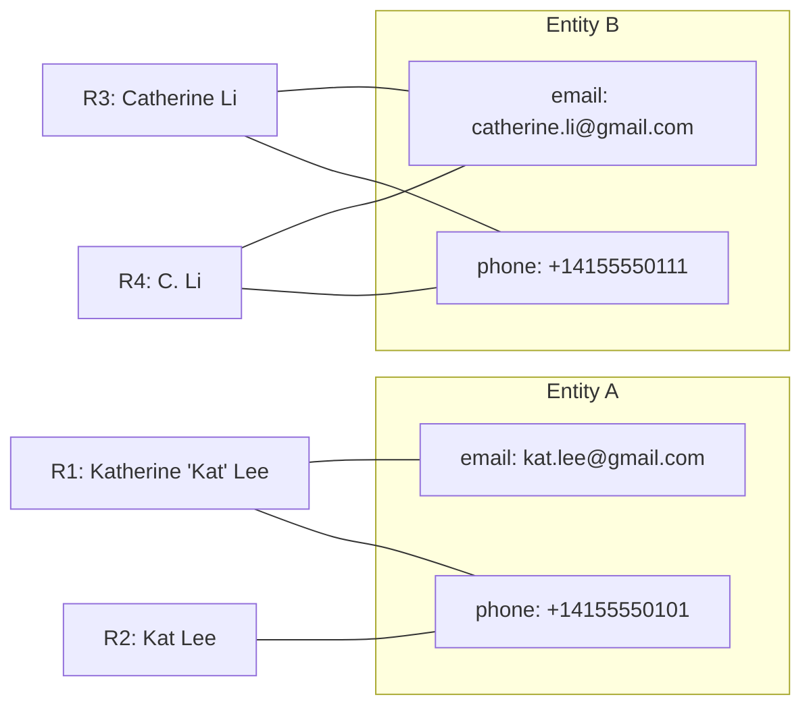
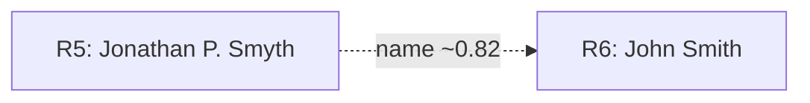

 # Entity Resolution: Linking Records to Real‑World Identities

## Overview

[Entity resolution](https://en.wikipedia.org/wiki/Record_linkage) is the process of linking records together to classify real world entities. In the connected age, data must reliably map back to real‑world entities. From a governance standpoint, we have to ensure that imposters don’t bypass laws and regulations [FINRA — Anti‑Money Laundering](https://www.finra.org/rules-guidance/key-topics/aml). On the broader internet, there’s often no guaranteed method to verify that someone is who they claim to be.

Financial institutions may appear to have it easy because they collect high‑assurance identifiers like SSNs or driver’s licenses. In practice, the hard part is linking records when those definitive identifiers are missing, outdated, or entered inconsistently across systems—at the extreme volumes modern platforms handle.

### Example

Keep it simple: two entities, one with a nickname and a missing attribute; another that looks similar but should not link.

| Record | Name                  | Email                       | Phone           |
|:------:|-----------------------|-----------------------------|-----------------|
| R1     | Katherine “Kat” Lee   | kat.lee@gmail.com           | 415‑555‑0101    |
| R2     | Kat Lee               |                             | +1 415 555 0101 |
| R3     | Catherine Li          | catherine.li@gmail.com      | 415‑555‑0111    |
| R4     | C. Li                 | catherine.li+work@gmail.com | +1 415 555 0111 |

Why R1 ↔ R2 link (after normalization):

- Nickname: “Kat” ↔ “Katherine”.
- Phone: Formatting and country code normalize to the same E.164 value (+14155550101).
- Email: R2 missing; two strong signals (name + phone) are enough to link.

Why R3 ↔ R4 link (after normalization):

- Phone: Same number after normalization (+14155550111).
- Email: Gmail plus‑tag variant maps to the same canonical address.
- Name: Initials align with the full name.

Why Entity A vs Entity B do not link:

- Different phones (…0101 vs …0111) and different surnames (Lee vs Li).

#### Fuzzy connection (candidate match)

Sometimes only the names are similar while phone and email disagree. That’s a low‑confidence, fuzzy connection you might surface for review—but not auto‑link.

| Record | Name               | Email                    | Phone         |
|:------:|--------------------|--------------------------|---------------|
| R5     | Jonathan P. Smyth  | jon.smyth@gmail.com      | 415‑555‑0123  |
| R6     | John Smith         | jsmith@yahoo.com         | 628‑555‑0123  |

Why this is a candidate, not a link:
- Names are similar (Smyth ↔ Smith; Jonathan ↔ John), but not exact.
- Both phone and email differ; strong identifiers disagree.
- Score likely below the link threshold; route to manual review or keep as a watchlist candidate.

### Entity Resolution Backend
Check out a ER backend demo made in python: [Entity-Resolution-Backend-Demo](https://github.com/MarcoBetti1/Entity-Resolution-Backend-Demo/tree/main)

### Entity Resolution Frontend
Check out a ER front end demo made in python: [Entity-Resolution-Frontend-Demo](https://github.com/MarcoBetti1/Entity-Resolution-Frontend)
